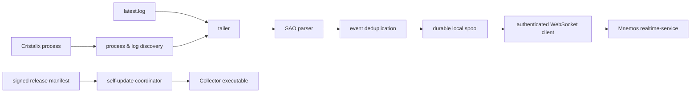
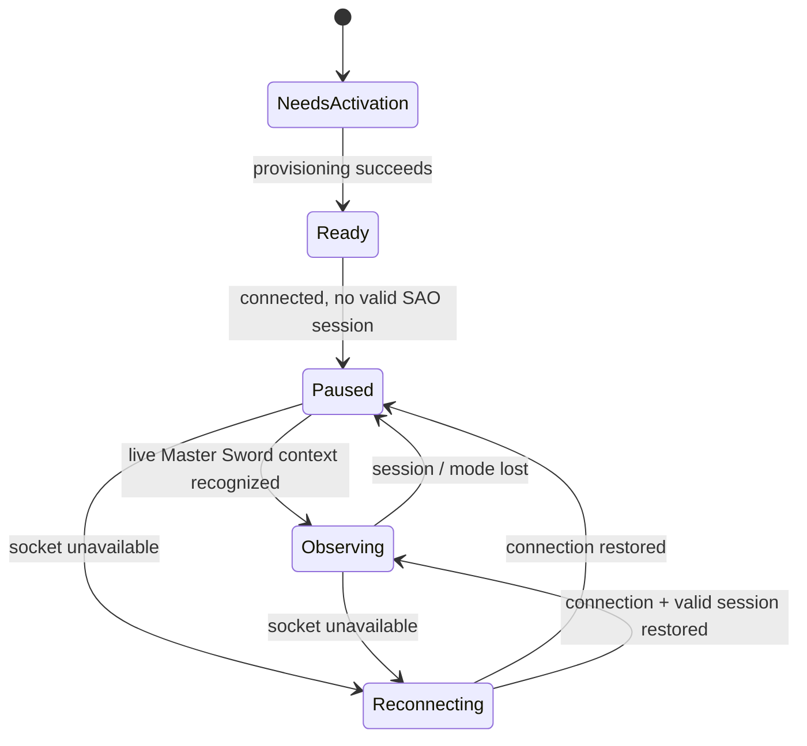

<div align="center">

# Mnemos Collector

### Native desktop collector for Cristalix / SAO events

**Rust · Tokio · WebSocket · secure provisioning · durable local spool · signed self-updates**

Companion client for [Mnemos](https://github.com/knliiss/Mnemos).

</div>

---

## Overview

Mnemos Collector is a native desktop client that observes a local Cristalix session and forwards supported SAO events to Mnemos.

It is intentionally more than a log tailer. The collector owns the complete client-side delivery path: installation, provisioning, credential storage, process and log discovery, SAO context detection, parsing, deduplication, durable buffering, realtime delivery, diagnostics and self-update handling.

<p align="center">
  
</p>

The UI exposes the state that matters at runtime: whether Cristalix is detected, which game mode is recognized, whether Mnemos is connected, queue pressure and diagnostic activity.

---

## Runtime pipeline



The collector only enters the active **OBSERVING** state after it has enough evidence that the current session is valid and the supported `Master Sword` context has been recognized. Otherwise the server connection is kept **PAUSED**.

---

## What it does

- detects Cristalix / Java process evidence and candidate log locations;
- discovers and follows the relevant `latest.log` file;
- reconstructs parser context without replaying stale historical events as fresh activity;
- recognizes the supported SAO game mode before reporting;
- parses game events and deduplicates short-window duplicates;
- persists pending reports to a local spool before network delivery;
- reconnects with bounded backoff when realtime connectivity is lost;
- sends collector state and event reports over an authenticated WebSocket connection;
- exposes runtime diagnostics in the desktop UI;
- provisions each installation with a server-issued collector credential;
- stores credentials in the platform credential store;
- installs per-user autostart for provisioned installations;
- checks signed releases and performs staged self-updates.

---

## State model



The server is explicitly told whether the collector is `PAUSED` or `OBSERVING`; event delivery is not inferred only from socket connectivity.

---

## Durable delivery

Network availability is not treated as a requirement for capturing an event.

Parsed reports are first placed in a local **report spool**. Delivery then drains that queue in bounded batches when realtime connectivity is available. On restart, the spool is reopened and recoverable pending reports can continue through the normal delivery path.

This keeps transient connectivity problems separate from event detection and avoids turning a short disconnect into silent data loss.

---

## Realtime protocol

The collector communicates with Mnemos through an authenticated WebSocket client.

The connection validates protocol compatibility and can enforce a server-provided minimum collector version. Collector state transitions are acknowledged by the server, so the UI and delivery loop have an explicit shared understanding of whether the client is currently observing.

Reconnect delay grows from a short initial delay up to a bounded maximum and is reset after a stable connection window.

---

## Security

### Provisioning

Collector installations are provisioned through a short-lived activation flow. The resulting access credential belongs to the installation rather than being embedded in the binary.

### Credential storage

Credentials are stored through platform-native secure storage. On Windows the collector uses **Windows Credential Manager** instead of writing the access key into a plaintext configuration file.

Stored credentials are validated during startup. A revoked or rejected credential is removed and the installation returns to activation instead of continuously reconnecting with invalid credentials.

### Secret handling

Sensitive activation values are handled with explicit zeroization where practical, and the collector never needs the user's Mnemos password or Telegram session.

---

## Self-updates

The update path is designed so a downloaded executable is not trusted merely because it came from the expected URL.

For each release the collector:

1. downloads a small release manifest;
2. selects the artifact for the current OS / architecture;
3. verifies the manifest entry using an embedded **Ed25519 public key**;
4. checks the artifact **SHA-256** after download;
5. stages the new executable separately;
6. hands off to the update helper;
7. requires the updated process to acknowledge healthy startup.

Update rollout is deterministically spread across a time window per collector ID so all installations do not update simultaneously.

---

## Diagnostics

The desktop UI and diagnostics module expose operational state such as:

- Cristalix detection;
- recognized game mode;
- realtime connection state;
- observing / paused state;
- selected log path;
- local queue size and recovery state;
- protocol versions;
- update requirements;
- recent diagnostic log entries.

This makes failures diagnosable without asking the user to reproduce internal state manually.

---

## Platform model

The codebase has platform-specific desktop and security implementations while keeping the collector runtime shared.

| Platform | Desktop / integration |
| --- | --- |
| Windows | Native Win32 shell, Credential Manager, per-user installation / autostart |
| Linux | `eframe` / `egui` desktop implementation |
| macOS | native / portable desktop support with platform keyring integration |

Release behavior is platform-aware (`windows-x86_64`, etc.) and the update manifest selects the matching artifact at runtime.

---

## Project structure

```text
src/
├── application.rs        main runtime loop
├── cristalix/            process, session and latest.log discovery
├── parser/               SAO log parsing and deduplication
├── realtime/             authenticated WebSocket protocol
├── spool.rs              durable pending-report storage
├── provisioning.rs       installation activation
├── credential_validation.rs
├── security/             platform credential storage
├── desktop/              native / portable UI
├── diagnostics.rs        runtime diagnostics and snapshots
├── platform/             installation and autostart integration
└── update/               signed staged self-update pipeline
```

---

## Development

The current crate targets **Rust 1.98** and edition **2024**.

```bash
cargo build
cargo test
```

For a release build:

```bash
cargo build --release
```

The repository also contains local PowerShell helpers for verification, build, run, status, logs, smoke checks and onboarding reset.

---

## Key dependencies

| Purpose | Crate |
| --- | --- |
| Async runtime | Tokio |
| HTTP | reqwest + rustls |
| WebSocket | tokio-tungstenite |
| Serialization | serde / serde_json |
| Credential storage | keyring + platform-specific integration |
| Update verification | ring + SHA-256 |
| Process inspection | sysinfo |
| Desktop UI | native Win32 / eframe |
| Secret cleanup | zeroize |

---

## Relationship with Mnemos

The collector deliberately does **not** implement Mnemos business logic.

Its responsibility ends at producing authenticated, well-formed observations. Mnemos owns persistence, event projections, account association, notification rules, realtime fan-out, social features and all product-facing behavior.

That separation keeps the desktop client small enough to audit while allowing the backend platform to evolve independently.

---

<div align="center">

**Current version:** `0.1.17`

</div>
